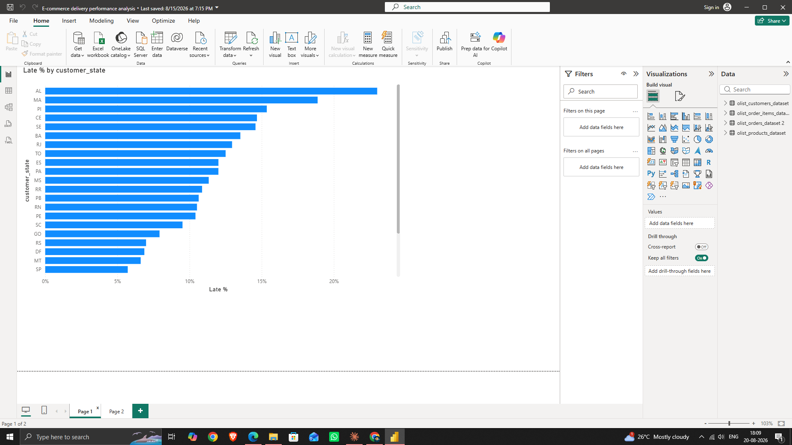

# E-Commerce Delivery Performance Analysis

**Business Analyst Case Study | Shruti Vishwakarma**

## Overview

Operations and customer support teams need visibility into delivery performance to reduce customer dissatisfaction and prioritize logistics improvements. This project analyzes 99,441 real orders from the [Olist Brazilian E-Commerce Public Dataset](https://www.kaggle.com/datasets/olistbr/brazilian-ecommerce) to identify where and how often deliveries run late.

## Key Findings

- **~7.9%** of all orders were delivered later than their promised estimated delivery date.
- Order **volume does not predict delay rate** — São Paulo (SP) has the highest order volume but one of the *lowest* late-delivery rates.
- The states with the **highest late-delivery rates** are:
  - Alagoas (AL) — 23%
  - Maranhão (MA) — 18.88%
  - Piauí (PI) — 15.35%
  - Ceará (CE) — 14.67%
  - Sergipe (SE) — 14.57%

  All well above the national average of 7.9%.

## Methodology

1. Flagged each order as Late/On-Time by comparing delivered date vs. estimated delivery date.
2. Connected the orders and customers tables (via `customer_id`) to bring in regional data.
3. Built a DAX measure to calculate the **true late-delivery rate within each state**, avoiding the misleading effect of high-volume states appearing "worse" by raw count alone.
4. Visualized findings in Power BI, sorted by actual late-delivery percentage.

## Deliverables

- [Business Requirements Document (BRD)]E%20commerce%20delivery%20performance
- Power BI dashboard (screenshot below)

## Tools Used

Microsoft Excel, Power BI (DAX measures, data modeling, relationships)

## Recommendations

Prioritize logistics/carrier review in the five flagged states, and reassess whether estimated delivery dates are realistic for these regions before assuming a carrier-side issue.
